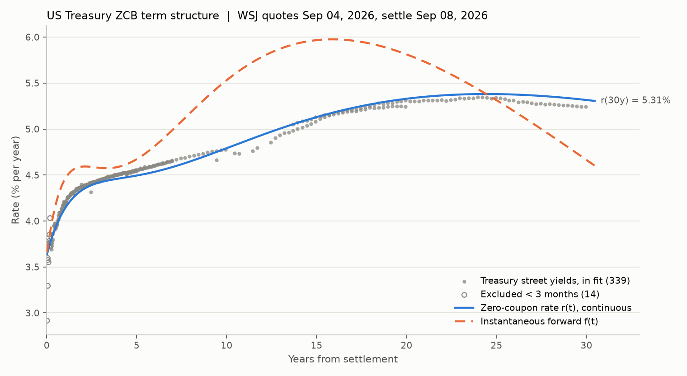

# Miniproject 2 - Creating a ZCB Term Structure

**FRE 6103 Valuation for Financial Engineering (NYU Tandon)** | Raj Pawar

A continuously compounded zero-coupon (ZCB) term structure fitted to all 353 US Treasury note and bond
quotes in the Wall Street Journal on Friday, September 4, 2026, using the Svensson (1994) functional
form. The output is the discount rate `r(t)` and discount factor `d(t) = exp(-r(t) t)` for every one of
the 245 distinct Treasury payment dates (coupons and principal) between September 2026 and August 2056,
implemented twice, in Python and in Excel, with both implementations reproducing the same numbers.

**Project page (interactive chart, tables, downloads):** https://pawarraj8888.github.io/zcb-term-structure/



## Results at a glance

| | |
|---|---|
| Quote date / settlement | Sep 4, 2026 / Sep 8, 2026 (T+1 business; Sep 7 is Labor Day) |
| Bonds in fit | 339 of 353 (14 bonds under 3 months to maturity excluded) |
| Model | Svensson: `r(t) = b0 + b1 L1(t) + b2 [L1(t) - e^(-t/T1)] + b3 [L2(t) - e^(-t/T2)]`, `Li(t) = (1 - e^(-t/Ti)) / (t/Ti)` |
| Parameters | b0 = 0.0000 (bound), b1 = 0.0363, b2 = 0.0447, b3 = 0.1623, T1 = 1.77, T2 = 15.99 |
| Yield RMSE (fitted bonds) | 2.9 bp (mean absolute 2.1 bp, worst 14.8 bp) |
| Nelson-Siegel benchmark | 7.5 bp RMSE |
| Zero curve | 3.63% (overnight), 4.14% (1y), 4.49% (5y), 4.79% (10y), 5.33% (20y), 5.32% (30y) |

The one-page methodology is in [`writeup/`](writeup/Miniproject2_ZCB_Term_Structure_Writeup.md)
(also as [PDF](writeup/Miniproject2_ZCB_Term_Structure_Writeup.pdf)).

## Repository layout

```
data/       Treasury_data_090426.xlsx          WSJ quotes exactly as provided (Week 2 resources)
python/     zcb/                               package: quotes.py, bonds.py, curves.py, analysis.py, report.py
            run_analysis.py                    full pipeline -> output/ and docs/data.json
            build_excel.py                     builds the Excel implementation with live formulas
            recalc_excel_mac.sh, verify_excel.py   recalculate in Excel (macOS) and prove Excel == Python
            build_notebook.py, write_methodology.py, build_site.py
            tests/                             pytest suite (32 tests)
notebooks/  Miniproject2_ZCB_Term_Structure.ipynb   executed walk-through notebook
excel/      Miniproject2_ZCB_Term_Structure.xlsx    Excel implementation (Solver-ready)
output/     zero_curve_payment_dates.csv, bond_fit.csv, results.json, figures/
writeup/    one-page methodology (md, html, pdf)
docs/       GitHub Pages site
```

## Method in five lines

1. **Parse quotes.** WSJ prices are in 32nds with a third decimal in eighths of a 32nd
   (`99.256 = 99 + 25.75/32`). Asked side. Verified by recomputing every WSJ asked yield (median error 0.02 bp).
2. **Cash flows.** Semi-annual coupons on the maturity day-of-month (month-end rule), face at maturity,
   actual/actual accrued interest, dirty = clean + accrued, `t` in years (actual/365) from settlement.
3. **Model.** Svensson zero curve; each bond's model dirty price is the sumproduct of its payments with
   `d(t_k)`. Nests Nelson-Siegel; closed-form instantaneous forward curve.
4. **Estimate.** Minimise the sum of squared price errors divided by modified duration (first-order yield
   errors), bonds with under 3 months to maturity excluded (GSW 2007), 19 multi-start least squares runs
   in Python; the same SSE cell is minimised with Solver in Excel.
5. **Report.** `r(t)`, `d(t)`, `f(t)` at all 245 payment dates; fit diagnostics; robustness
   (convention check, Nelson-Siegel comparison, profile over the weakly identified level `b0`).

## Reproduce

```bash
cd python
python3 -m pip install -r requirements.txt
python3 run_analysis.py --data ../data/Treasury_data_090426.xlsx --out ../output --site ../docs
python3 write_methodology.py                  # writeup/*.md|html|txt from output/results.json
python3 build_excel.py                        # excel/Miniproject2_ZCB_Term_Structure.xlsx
./recalc_excel_mac.sh && python3 verify_excel.py   # macOS + Excel: recalculate, then prove Excel == Python
python3 build_notebook.py                     # executes notebooks/*.ipynb
python3 build_site.py                         # docs/data.js + copies of downloads
python3 -m pytest -q tests
```

## Excel implementation

`excel/Miniproject2_ZCB_Term_Structure.xlsx` re-derives everything from the raw quotes with formulas:
32nds conversion, `COUPPCD/COUPNCD/COUPDAYBS/COUPDAYS` for schedules and accrued interest, `YIELD` and
`MDURATION` for street yields and duration weights, a `CashFlows` sheet with every payment date, its
Svensson zero rate and present value, and a `ZeroCurve` sheet with the deliverable table and chart. The
six parameters live on `Inputs` next to the weighted SSE cell; Solver instructions are on the sheet.
`verify_excel.py` confirms that every Excel model price, yield, duration and zero rate matches Python.

## References

- Svensson, L. E. O. (1994), "Estimating and Interpreting Forward Interest Rates: Sweden 1992-1994", NBER WP 4871.
- Nelson, C. R. and Siegel, A. F. (1987), "Parsimonious Modeling of Yield Curves", Journal of Business 60(4).
- Gurkaynak, R. S., Sack, B. and Wright, J. H. (2007), "The U.S. Treasury Yield Curve: 1961 to the Present", Journal of Monetary Economics 54(8).
- Shimko, D. C., FRE 6103 Lecture 2B "Bonds and rates", slides 29-35.

MIT License.
